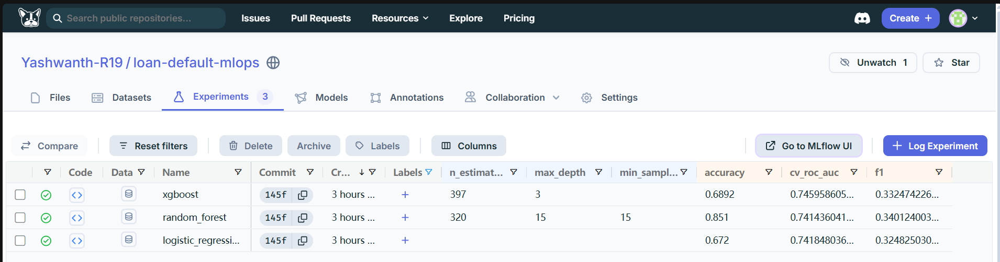
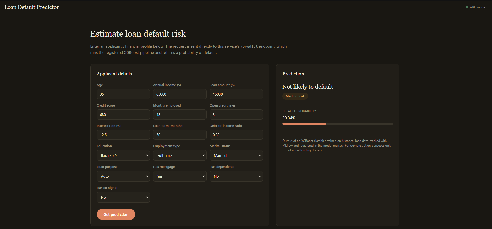
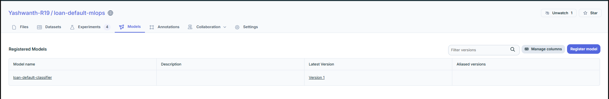
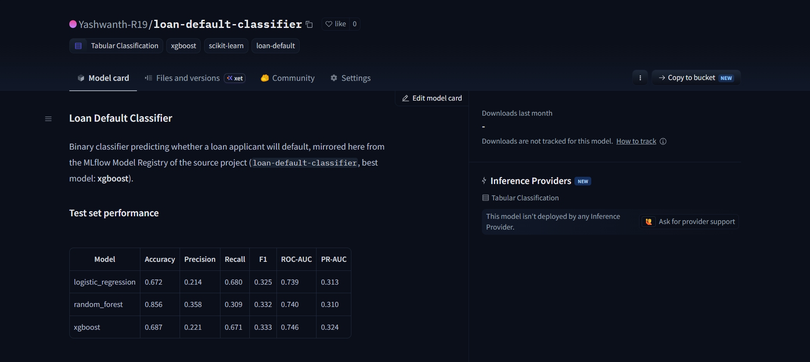
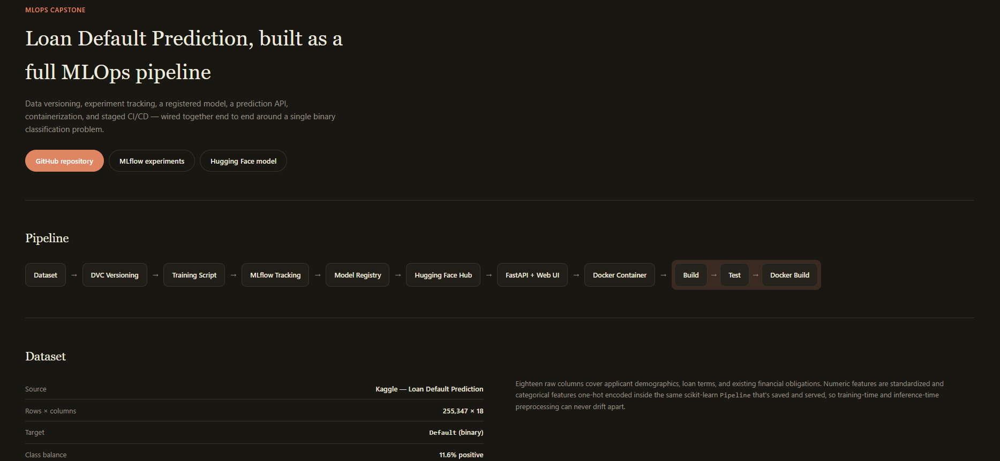

# Loan Default MLOps Pipeline


Predicts whether a loan applicant will default, using the [Loan Default Prediction dataset](https://www.kaggle.com/datasets/nikhil1e9/loan-default) (Kaggle, 255,347 rows). Built as an end-to-end MLOps pipeline: DVC data/model versioning, MLflow experiment tracking + model registry (hosted on [DagsHub](https://dagshub.com/Yashwanth-R19/loan-default-mlops)), a model mirror on [Hugging Face Hub](https://huggingface.co), a FastAPI prediction service with a browser UI, Docker containerization, and a staged GitHub Actions pipeline.

**Documentation site:** [yashwanth-r19.github.io/loan-default-mlops](https://yashwanth-r19.github.io/loan-default-mlops/)

## Pipeline

```
Dataset -> DVC Versioning -> Training Script -> MLflow Tracking -> Best Model
        -> Model Registry -> Hugging Face Hub -> FastAPI + Web UI -> Docker Container
        -> GitHub Repository -> GitHub Actions (Build -> Test -> Docker Build)
```

## Dataset

- **Source:** [kaggle.com/datasets/nikhil1e9/loan-default](https://www.kaggle.com/datasets/nikhil1e9/loan-default)
- **Size:** 255,347 rows, 18 columns, no missing values
- **Target:** `Default` (binary) — 11.6% positive class
- **Used for training:** a stratified 50,000-row subsample (80/20 stratified train/test split), for fast local iteration — see `params.yaml`

## Results

Three models were tuned with Optuna (25 trials, 3-fold stratified CV, optimizing ROC-AUC) and tracked in MLflow:

| Model | Accuracy | Precision | Recall | F1 | ROC-AUC | PR-AUC |
|---|---|---|---|---|---|---|
| Logistic Regression | 0.672 | 0.213 | 0.680 | 0.325 | 0.739 | 0.313 |
| Random Forest | 0.851 | 0.350 | 0.331 | 0.340 | 0.739 | 0.309 |
| **XGBoost (best)** | 0.689 | 0.221 | 0.667 | 0.332 | **0.745** | 0.324 |

XGBoost was selected on ROC-AUC and registered in the MLflow Model Registry (`loan-default-classifier`, stage: Production). Precision is low across all three models because of the ~88/12 class imbalance and the choice to rank by ROC-AUC rather than accuracy — this is a deliberate tradeoff to keep recall (catching actual defaults) reasonably high.



See `reports/shap_summary.png` for feature-level explainability of the winning model:


## Web UI

`/` serves a single-page prediction UI — fill in an applicant's details and get a live prediction from the running model, no API client required. It calls the same `/predict` endpoint the tests and curl examples below use.



## Project structure

```
loan-default-mlops/
|-- data/
|   |-- raw/                      # original dataset (DVC-tracked)
|   |-- processed/                # train/test splits (DVC-tracked)
|-- models/
|   |-- model.pkl                  # best pipeline: preprocessing + XGBoost (DVC-tracked)
|-- reports/
|   |-- metrics.json               # test metrics for all 3 models (git-tracked)
|   |-- shap_summary.png           # SHAP explainability plot (DVC-tracked)
|-- src/
|   |-- data_prep.py               # stratified subsample + train/test split
|   |-- train.py                   # Optuna tuning, MLflow tracking, model registry, SHAP, HF Hub push
|   |-- predict.py                  # inference logic (loads models/model.pkl)
|   |-- app.py                       # FastAPI app (/, /predict, /health)
|   |-- utils.py                     # shared paths, config, preprocessing
|   |-- static/
|   |   |-- index.html                # browser prediction UI, served at /
|-- tests/                           # pytest suite
|-- docs/
|   |-- index.html                   # GitHub Pages documentation site
|   |-- screenshots/                 # submission screenshots (see docs/screenshots/README.md)
|-- .github/workflows/
|   |-- build.yml                    # install deps, verify imports
|   |-- test.yml                     # pytest, gated on Build succeeding
|   |-- docker-build.yml             # docker build, gated on Test succeeding
|   |-- pages.yml                    # deploys docs/ to GitHub Pages
|-- Dockerfile
|-- .dockerignore
|-- requirements.txt
|-- params.yaml                      # pipeline configuration
|-- dvc.yaml / dvc.lock              # DVC pipeline (prepare -> train)
|-- conftest.py
|-- README.md
```

## Setup

```powershell
python -m venv venv
.\venv\Scripts\Activate.ps1
pip install -r requirements.txt
```

Copy `.env.example` to `.env` and fill in your DagsHub username + access token (used for MLflow tracking and the DVC remote). Hugging Face Hub credentials are optional — see `.env.example` for exactly which variables are needed and what each is for.

## Reproducing the pipeline

```powershell
dvc pull          # fetch the dataset + trained model from the DagsHub remote
dvc repro         # re-run prepare + train stages if you want to retrain from scratch
```

Every run is logged to MLflow at `https://dagshub.com/Yashwanth-R19/loan-default-mlops.mlflow` (Experiments tab on the DagsHub repo page). If `HF_TOKEN`/`HF_REPO_ID` are set in `.env`, `train.py` also mirrors the winning pipeline to Hugging Face Hub — see [Model Hosting](#model-hosting).

## Running the API

```powershell
uvicorn src.app:app --reload --port 8000
```

Open [http://127.0.0.1:8000/](http://127.0.0.1:8000/) for the prediction UI, or [http://127.0.0.1:8000/docs](http://127.0.0.1:8000/docs) for interactive Swagger docs.

```powershell
curl -X POST http://127.0.0.1:8000/predict `
  -H "Content-Type: application/json" `
  -d '{"Age":35,"Income":65000,"LoanAmount":15000,"CreditScore":680,"MonthsEmployed":48,"NumCreditLines":3,"InterestRate":12.5,"LoanTerm":36,"DTIRatio":0.35,"Education":"Bachelor'"'"'s","EmploymentType":"Full-time","MaritalStatus":"Married","HasMortgage":"Yes","HasDependents":"No","LoanPurpose":"Auto","HasCoSigner":"No"}'
```

Response:
```json
{"prediction": 0, "default_probability": 0.4148, "risk_label": "Medium"}
```

## Running in Docker

```powershell
docker build --load -t loan-default-mlops:latest .
docker run -d --name loan-default-api -p 8000:8000 loan-default-mlops:latest
```

Note: `--load` is required on setups where `docker build` defaults to buildx's `docker-container` driver (build-cache only, not loaded into the local image list) — without it, `docker run` fails to find the image.

## Tests

```powershell
pytest -v
```

Covers config/preprocessing sanity checks, inference correctness and output bounds, the API's success + validation-error paths, and that the web UI is served at `/`.

## CI/CD

Every push/PR runs a staged pipeline of three chained GitHub Actions workflows instead of one monolithic job:

1. **[Build](.github/workflows/build.yml)** — triggers on push/PR, installs dependencies, and verifies every module imports cleanly.
2. **[Test](.github/workflows/test.yml)** — triggers automatically once Build succeeds, pulls the trained model from the DagsHub DVC remote (requires the `DAGSHUB_USERNAME` and `DAGSHUB_TOKEN` repository secrets), and runs the full pytest suite.
3. **[Docker Build](.github/workflows/docker-build.yml)** — triggers automatically once Test succeeds, pulls the model, and builds the Docker image.

A fourth, independent workflow, **[Deploy Docs](.github/workflows/pages.yml)**, publishes `docs/` to GitHub Pages whenever it changes on `main`.

Because each stage only runs after the previous one succeeds, a broken build or a failing test stops the pipeline before an image is ever built.

## Model Hosting

The winning model is registered in two places:

- **MLflow Model Registry** (primary), hosted on DagsHub — `loan-default-classifier`, stage: Production.
- **Hugging Face Hub** (mirror) — pushed automatically by `train.py` when `HF_TOKEN`/`HF_REPO_ID` are set in `.env`, so the model is also browsable and downloadable outside the DagsHub/MLflow ecosystem.





## Documentation

A minimal documentation site (`docs/index.html`) is deployed to GitHub Pages on every change: [yashwanth-r19.github.io/loan-default-mlops](https://yashwanth-r19.github.io/loan-default-mlops/). It covers the pipeline, dataset, results, and a screenshot gallery.



## Tech stack

Python 3.12 - pandas / scikit-learn / XGBoost - Optuna - SHAP - MLflow (tracking + model registry, hosted on DagsHub) - Hugging Face Hub (model mirror) - DVC (data + model versioning, DagsHub remote) - FastAPI + Pydantic - Docker - GitHub Actions - pytest

## Screenshots

Full-resolution images live in [`docs/screenshots/`](docs/screenshots/) — see [`docs/screenshots/README.md`](docs/screenshots/README.md) for exactly which filename each capture should use.

### Required (submission minimum)

- [x] GitHub repository link — [github.com/Yashwanth-R19/loan-default-mlops](https://github.com/Yashwanth-R19/loan-default-mlops)
- [ ] Screenshot: MLflow experiments comparison — `docs/screenshots/mlflow-experiments.png`
- [ ] Screenshot: registered model — `docs/screenshots/model-registry.png`
- [ ] Screenshot: successful DVC tracking — `docs/screenshots/dvc-tracking.png`
- [ ] Screenshot: successful GitHub Actions runs — `docs/screenshots/gh-actions-build.png`, `gh-actions-test.png`, `gh-actions-docker-build.png`
- [ ] Screenshot: FastAPI prediction endpoint — `docs/screenshots/fastapi-docs-swagger.png`

### Recommended

- [ ] Screenshot: prediction UI, blank form — `docs/screenshots/prediction-ui-empty.png`
- [ ] Screenshot: prediction UI, with result — `docs/screenshots/prediction-ui-result.png`
- [ ] Screenshot: Docker container running — `docs/screenshots/docker-running.png`
- [ ] Screenshot: DVC pipeline DAG (`dvc dag`) — `docs/screenshots/dvc-dag.png`
- [ ] Screenshot: Hugging Face model page — `docs/screenshots/huggingface-model.png`
- [ ] Screenshot: GitHub Pages documentation site — `docs/screenshots/github-pages-site.png`
